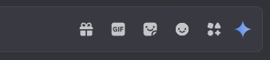
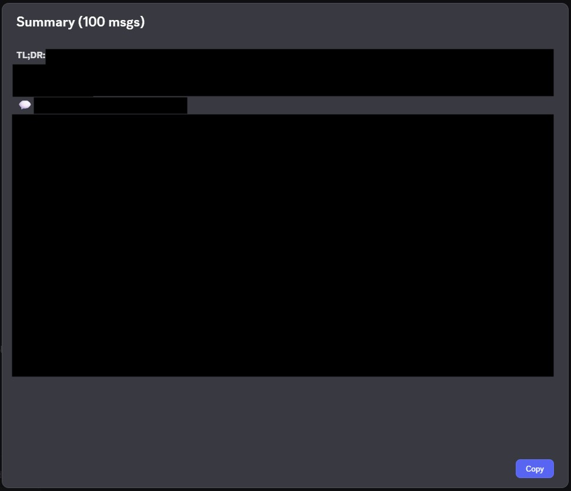

# Gemini Integration for Shelter/Legcord

A powerful Discord client plugin that integrates Google's Gemini AI to provide intelligent conversation summaries with context-aware display names and role colors.



*The Gemini AI button integrated into Discord's chat interface*

## ✨ Features

- **📝 Smart Conversation Summaries**: Generate synthesis-style summaries of Discord conversations with specific subject names and key takeaways
- **👥 Discord-Native Display**: Shows real Discord nicknames with their role colors in summaries
- **💚 Personal Mentions**: Highlights when you're mentioned in conversations with green color
- **📚 Summary History**: Keeps the last 5 summaries per channel without consuming API quota
- **🌍 Multilingual Support**: Full internationalization in 8 languages (EN, FR, DE, ES, PT, IT, JA, RU)
- **⚡ Rate Limiting**: Built-in rate limiting and daily usage tracking (20 requests/day on free tier)
- **🎨 Beautiful UI**: Clean, Discord-themed interface with toast notifications and modals

## 🖼️ Summary Quality

Unlike generic AI summaries, this plugin creates **synthesis-style summaries** that:
- Name specific subjects (games, people, projects) instead of generic categories
- Synthesize group consensus or debates rather than listing individual reactions
- Highlight what matters: key info, decisions, and unanswered questions
- Use Discord @mentions with role colors for visual context
- Highlight your mentions in green so you know when people talked about you

**Example output:**
```markdown
**TL;DR:** The group is excited about Helldivers 2 with praise for its coop gameplay and fair monetization model.

## 🎮 Helldivers 2
The group is enthusiastic about Helldivers 2. @alice asked for opinions and everyone agrees on the excellent coop gameplay. @dave notes that the monetization model is fairer than the competition. Open question: will the hype last?
```

## 📦 Installation

### Prerequisites

- [Legcord](https://github.com/legcord/legcord) or another Discord client with [Shelter](https://github.com/uwu/shelter) support
- A Google Gemini API key (free tier available)

### Step-by-Step Installation

#### 1. Install the Plugin

1. Open **Legcord**
2. Go to **User Settings** → **Shelter** → **Plugins**
3. Click **"Add Plugin"** or paste the plugin URL
4. Enter the following URL:
   ```
   https://shalyss.github.io/shelter-plugins/gemini-summarize/plugin.js
   ```
5. The plugin will automatically download and install
6. Enable the plugin in the Shelter plugins list

#### 2. Get Your Gemini API Key

1. Visit [Google AI Studio](https://aistudio.google.com/app/apikey)
2. Sign in with your Google account
3. Click **"Create API Key"**
4. Copy your new API key

**Free Tier Limits:**
- 20 requests per day
- Rate limits may apply

#### 3. Configure the Plugin

1. Open Shelter settings (**User Settings** → **Shelter** → **Plugins**)
2. Find **"Gemini Integration"** in the plugin list
3. Click on it to open settings
4. Paste your API key in the **"Gemini API Key"** field
5. (Optional) Choose your preferred:
   - **Gemini Model**: Default is `gemini-2.5-flash` (recommended)
   - **Language**: Auto-detected from Discord, or choose manually
   - **Daily Limit**: Default is 20 requests/day, set to -1 for unlimited (if you have a paid API key)


*Configure your API key, model, language, and daily request limits*

#### 4. Start Using It!

1. Navigate to any Discord text channel
2. Look for the **Gemini AI button** (sparkle icon ✨) next to the chat input
3. Click it to open the summary modal
4. Done! You're ready to summarize conversations

## 🚀 Usage

### Creating a Summary


*Enter the number of messages to summarize with real-time quota tracking*

1. Click the **Gemini AI button** in the chat input area
2. Enter the **number of messages** you want to summarize (default: 100)
3. Check your **daily quota** and **reset time** displayed in the modal
4. Click **"Summarize"**
5. Wait for the AI to process (loading toast will appear)


*Real-time feedback during summary generation*

### Viewing the Result



*AI-generated summary with Discord @mentions and accurate role colors*

The summary will include:
- **TL;DR**: A quick one-line summary
- **Topics**: Organized by subject with key points
- **@Mentions**: Real Discord users with their role colors
- **Your Mentions**: Highlighted in green when someone talked about you
- **Open Questions**: Unanswered questions from the conversation

### Using Summary History

- The plugin saves the **last 5 summaries per channel**
- Access them from the summary modal history section
- Click any entry to view it again **without using API quota**
- History is stored locally and persists across sessions

### Daily Usage Tracking

- See your daily API usage in the summary modal
- Free tier: 20 requests per day
- Usage resets at midnight UTC

## 🌐 Supported Languages

The plugin automatically adapts to your Discord language setting:

- 🇺🇸 English (en-US)
- 🇫🇷 French (fr)
- 🇩🇪 German (de)
- 🇪🇸 Spanish (es-ES)
- 🇧🇷 Portuguese (pt-BR)
- 🇮🇹 Italian (it)
- 🇯🇵 Japanese (ja)
- 🇷🇺 Russian (ru)

All UI elements, prompts, and messages are fully localized.

> **Note:** Translations were AI-generated and may contain errors. If you notice any mistakes or have suggestions for improvements, please don't hesitate to submit a pull request! Native speakers are especially welcome to review and improve translations.

You can manually override the language in the plugin settings if needed.

## ⚙️ Configuration

### Settings

- **Gemini API Key**: Your personal API key (required)
- API key is stored locally in Shelter's plugin store

### Rate Limiting

- **Local**: Max 5 requests per minute
- **Remote**: Respects Gemini API rate limits (429 responses trigger retry)
- **Daily**: 20 requests/day on free tier (tracked locally)

## 🛠️ Technical Details

### Architecture

- **Framework**: Shelter plugin system for Legcord
- **API**: Google Gemini 2.5 Flash model with fallback chain
- **Stores**: Uses Discord's Flux stores (GuildMemberStore, UserStore, GuildStore)
- **Storage**: Plugin settings and history stored in Shelter's plugin.store
- **Styling**: Discord-native CSS variables with fallback values

### Display Name Resolution

The plugin intelligently resolves display names using a 3-tier system:
1. Display name map from message formatting
2. Message cache lookup
3. Guild member iteration with role color extraction

### Color System

- @mentions show user's highest role color from Discord
- Current user mentions always show in green (#43b581)
- Role colors converted from integer to hex format

## 🔒 Privacy & Security

- **Local Storage**: API key stored locally in Shelter's plugin store
- **No Tracking**: No analytics or external tracking
- **API Calls**: Only to Google's Gemini API
- **Discord ToS**: Use at your own risk - client modifications may violate Discord's Terms of Service

## 🐛 Troubleshooting

### "No messages to summarize"
- Ensure the channel has messages
- Check that you have the correct permissions to view message history

### "Rate limit exceeded"
- Wait 1 minute if you hit the local rate limit (5 requests/min)
- Check your daily usage (20 requests/day on free tier)

### Toast notification not appearing
- Toast is positioned above the text input (80px from bottom, centered)
- Check browser console for errors

### Display names not showing correctly
- Ensure Discord stores are loaded (wait a few seconds after startup)
- Check that you're in a server (not DMs) for role colors

## 📝 Contributing

Contributions are welcome! Please:
1. Fork the repository
2. Create a feature branch
3. Make your changes with clear commit messages
4. Test thoroughly with different Discord locales
5. Submit a pull request

## 📄 License

This project is open source. Please check the LICENSE file for details.

## 🙏 Acknowledgments

- Built for the [Shelter](https://github.com/uwu/shelter) plugin system
- Compatible with [Legcord](https://github.com/legcord/legcord)
- Powered by Google's Gemini AI

## ⚠️ Disclaimer

This plugin modifies your Discord client. Using client modifications may violate Discord's Terms of Service. Use at your own risk. The developers are not responsible for any consequences of using this plugin.